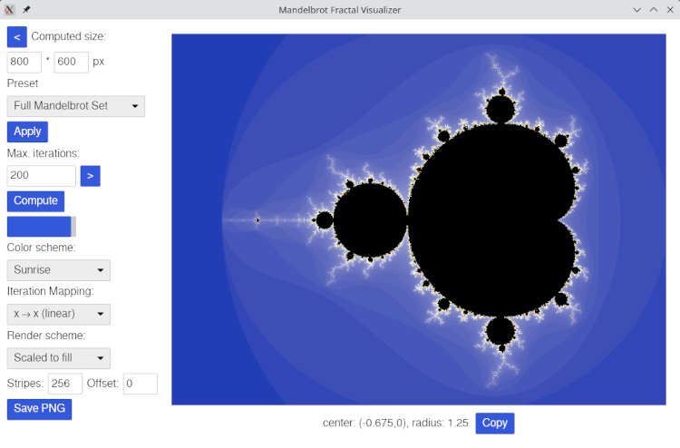

# Mandel.rs - A fractal graphics visualizer

_A project to learn the Rust programming language with the help of AI_

This project implements a fractal graphics program from scratch in Rust. I use this to

1. Write a fractal graphics program I always wanted to have but could not find so far
2. Learn Rust
3. Use AI help for this endeavour.

See [installation instructions](INSTALL.md) on how to install this program locally.
Note that you might need to compile it yourself in certain environments.

## Features of this program

This program is in its infancy. It can

* Show the Mandelbrot fractal with the famous escape speed stripe visualization
* Select from a (small) list of initial spots
* Select visualization colors from a (small) list of color tuples and different iteration-to-color-index functions
* Select maximum iteration depth and output image size
* Zoom and pan the computed area

It implements these features on a foundation I hope to be quite powerful:

* Visualization is _independent_ from computation, i.e. colors and color assignments to iteration depths can be changed _without_ recomputation
* Continuous update of visualization during computation
* Sophisticated data storage engine with two storage areas: One highly parallel accessible for the computation algorithm, one very speedy for the vizualisation, both connected with an event messaging queue
* Resolution of computation stage completely independent of screen resolution or window size.

Additionally, I have a clear vision about crucial features:

* Local GUI in the beginning, probably abandoned for remote control.
* Remote control through a client-server structure with a browser-based interface
* Batch computation of (very) high resolution images

## The "Learning with AI" stuff

The AI I start with in "Claude Code". I record the sessions with the AI and store them in the `session-protocols` folder. Together with the commits of the projects these allow to follow how communication with the AI worked.

It is important to inform the AI about what the plan is and how implementation should take place. I do this by writing "manifestos" before starting an actual implementation. This formalizes a step every programmer should do before coding start: Thinking about what is to be developed and what the goals are. You find these manifestos in the [manifestos subdirectory](manifestos/). Note that the [first manifesto](manifestos/manifesto-01-initial-project-master-plan.md) has been moved there retroactively; in the beginning it has been the project's README.

As co-working with an AI is also an important part of this project, I record the AI session and [store these records](session-protocols/) within the project. Hopefully, this gives some insights on how working with an AI on a software project is mid-2025.

As I want to learn programming in Rust, the AI has a _passive_ role in this project: It explains, it reviews, it tutors, and it
is a counterpart for discussing design decisions. This _is_ actually helpful, one only has to be careful not to fall for the AI:
Especially in such a "tutor" mode, it behaves like a very obident Labrador Retriever dog: It likes and favors absolutely _everything_
the human writes ("Your implementation is very efficient."), designs ("Your architecture is spot-on.") or even asks ("Good question!"/"Excellent question!"/"Your question shows your deep insight."). To put it like this: This is not always the most
truthful feedback…

The AI has one active role with the code: It writes the source code documentation. I would never have been able to write so
much code documentation in such high quality. In my opinion, the AI really shines with this task.

## Yet another Mandelbrot visualizer?

I am very aware that this is not the first program showing the Mandelbrot set.
It is not even _my_ first program to show the Mandelbrot set.
Actually, this is the fifth or sixth time I program this stuff myself:

* In 1988, I used a version mainly copied from a computer magazine on an Amstrad CPC6128 written in Basic and Z80 Assembler (only the main iteration loop). It needed a whole night to compute a 320*200 pixel image with 4 colors and a maximum iteration depth of 255.
* In 1990, I wrote my first own implementation in Turbo Pascal. It could iterate somehow deeper than 255 and only needed several hours on a 10 MHz 80286 for images in EGA/Hercules resolution.
* During the 1990ies, this program faced several enhancements and revisions. Finally, my interest in the topic faded away.
* Only in 2017, I started another approach. I selected Java as implementation platform and used stuff like BigDecimal to be able to produce really deep zoom images. I even transferred a pertubation-based computation algorithm from C++ to Java to speed things up. Unfortunately, I only had the already outdated Swing library for the GUI. Eventually, I stumbled upon several problems: Java is not the best language for heavy numerical computations and the whole thing became a quite complex mess. The project stalled during 2018 and never gained traction again.
* Finally, in 2025, I decided to learn Rust, use an AI as tutor and take a not-too-simple topic I was already familiar with as project. This way I came to the Mandelbrot set again. The result is mandel-rs as you see it just now.

## License

mandel.rs is published under the [GNU AGPL 3.0](https://www.gnu.org/licenses/agpl-3.0.html.en) license
which is also included in this repository in the LICENSE file.

## Famous last words

This is a hobby project (won't be big and professional like GNU). Don't hold your breath.
